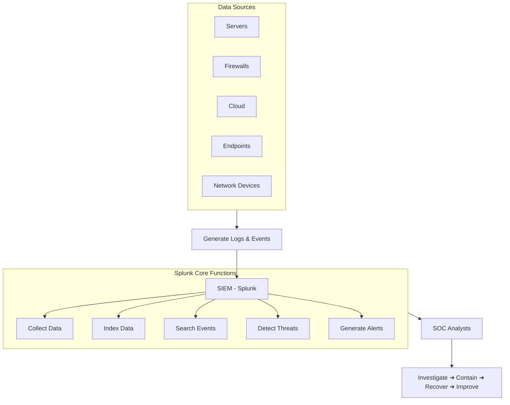

# Splunk and SOC Upskilling

This repository documents my research and practical setup for Security Operations Centre (SOC) fundamentals, SIEM technologies, and Splunk architecture.

## 1. Security Operations Centre (SOC) Fundamentals

**What is a SOC?**
A Security Operations Centre (SOC) is a centralised function within a business that employs people, processes, and technology to continuously monitor and improve the organisation's security posture. Its primary goal is to prevent, detect, analyse, and respond to cybersecurity incidents.

**Key Functions:**
* **Monitoring:** 24/7 observation of the IT environment to ensure complete visibility.
* **Detection:** Spotting suspicious activity or anomalies within the network traffic and logs.
* **Triage:** Assessing and prioritising alerts to separate genuine threats from false positives.
* **Incident Response:** Taking immediate action to contain and eradicate confirmed threats.
* **Threat Intelligence:** Gathering data on current global threats and adapting defences accordingly.

**Common Technologies:**
* **SIEM (Security Information and Event Management):** The core tool for ingesting logs and alerting (e.g., Splunk, Microsoft Sentinel).
* **EDR/XDR (Endpoint/Extended Detection and Response):** Monitoring individual devices like laptops and servers for malicious activity.
* **SOAR (Security Orchestration, Automation, and Response):** Automating repetitive responses to common alerts.
* **Firewalls & IDS/IPS:** Network barriers and Intrusion Detection/Prevention Systems.

**Processes (The Incident Response Lifecycle):**
1. **Preparation:** Setting up tools, configuring rules, and training staff.
2. **Identification:** Detecting a potential incident via alerts or hunting.
3. **Containment:** Stopping the threat from spreading (e.g., isolating an infected laptop from the network).
4. **Eradication:** Removing the threat entirely (e.g., deleting malware).
5. **Recovery:** Restoring systems to normal, secure operation.
6. **Lessons Learned:** Documenting the incident to improve future responses and update rules.

**Challenges:**
* **Alert Fatigue:** Analysts becoming overwhelmed by the sheer volume of alerts and false positives.
* **Evolving Threats:** Cybercriminals constantly adapting their tactics, techniques, and procedures (TTPs).
* **The Skills Gap:** Finding and retaining highly trained security personnel.

**SOC Best Practices:**
* **Automation:** Using tools like SOAR to handle low-level alerts so analysts can focus on complex threats.
* **Continuous Tuning:** Regularly updating SIEM rules to reduce noise and false positives.
* **Threat Intelligence Integration:** Staying ahead by feeding real-time global threat data into local systems.

**Roles within a SOC:**

| Role | Responsibilities |
| :--- | :--- |
| **Tier 1 Analyst** | Triage. Reviews initial alerts, determines if they are true or false positives, and handles basic incidents. |
| **Tier 2 Analyst** | Incident Responder. Takes escalated tickets, performs deep-dive investigations, and contains the threat. |
| **Tier 3 Analyst** | Threat Hunter. Proactively searches the network for hidden threats that bypassed automated detection. |
| **SOC Manager** | Oversees operations, manages the team, handles budgeting, and reports to the CISO. |

**Threat Hunting:**
Unlike detection, which is reactive (waiting for a SIEM alert to fire), threat hunting is **proactive**. Analysts assume the network has already been breached and actively search through data to find sophisticated threats that have bypassed automated security controls.

**Common Event Types to Look Out For:**
* **Failed Login Attempts:** Especially "brute force" patterns (e.g., hundreds of failed logins in a minute).
* **Unusual Outbound Traffic:** Large amounts of data leaving the network, which could indicate data exfiltration.
* **Privilege Escalation:** A standard user suddenly attempting to gain administrative rights.
* **Suspicious File Executions:** Unknown or malicious software (malware) running on an endpoint.

## 2. SIEM (Security Information and Event Management)

**What is SIEM?**
SIEM is a software solution that ingests, aggregates and analyses activity from many different resources across an entire IT infrastructure. It collects machine-generated logs (the "Information"), translates/parses them into a readable format, and uses rules to identify suspicious patterns, generating alerts (the "Event Management") for security analysts to investigate.

**An Analogy for SIEM:**
Imagine a large casino with hundreds of security cameras, card readers, and cash registers. 
* Individually, these devices generate too much raw data for one person to watch simultaneously. 
* A **SIEM** acts like the central security control room. It takes the feed from every single camera, door, and register across the building and puts them onto one massive wall of screens. 
* Crucially, it doesn't just show the data; it uses logic. If it notices a door being forced open while the camera feed in that hallway suddenly goes blank, it sounds an alarm for the human guards (the SOC analysts) to investigate.

### High-Level SOC & SIEM Data Flow

**Examples of SIEM Software in 2026:**
* **Splunk Enterprise Security:** Highly customisable and dominant in large enterprises.
* **Microsoft Sentinel:** A cloud-native SIEM tightly integrated with the Azure ecosystem.
* **IBM QRadar:** Known for its strong out-of-the-box behavioural analytics.
* **Google SecOps (formerly Chronicle):** Designed to handle massive volumes of data at incredibly high speeds using Google's infrastructure.
* **Datadog Cloud SIEM:** Popular for its strong integration with developer and operational monitoring tools.

## 3. Introduction to Splunk

**What is Splunk?**
Splunk is a powerful software platform used to search, analyse, and visualise machine-generated data in real-time. While it started as a general data analysis tool, its ability to handle massive volumes of logs quickly made it the industry standard SIEM platform for enterprise cybersecurity.

**What can Splunk be used for and why use it?**
* **Cybersecurity (SIEM):** Detecting threats, investigating breaches, and monitoring network health.
* **IT Operations:** Troubleshooting application crashes, monitoring server performance, and predicting hardware failures.
* **Business Analytics:** Tracking user behaviour on websites, monitoring sales transactions, and visualising customer trends.
* **Why use it?** It is incredibly fast at searching unindexed, unstructured data (like raw text logs). It scales to handle petabytes of data, and its dashboarding capabilities make complex data easy to understand for non-technical stakeholders.

**What is a Splunk/SOC Analyst?**
A SOC Analyst using Splunk is a security professional who uses the platform as their primary tool to monitor an organisation's network. They write custom SPL (Splunk Processing Language) queries to investigate alerts, create dashboards to monitor threat trends, and tune the system to detect new attack methods while reducing false positives.

**Versions of Splunk:**
| Version | Description |
| :--- | :--- |
| **Splunk Enterprise** | The core, on-premises software. Highly customisable and installed on a company's own local servers. |
| **Splunk Cloud Platform** | The SaaS (Software as a Service) version. Splunk hosts and manages the infrastructure, reducing overhead for the business. |
| **Splunk Free** | A limited version for personal use or very small environments, restricted to ingesting 500MB of data per day with no alerting capabilities. |
| **Splunk Enterprise Security (ES)** | A premium application built on top of Splunk Enterprise, specifically designed with pre-built SOC dashboards, incident review tools, and advanced threat intelligence integrations. |

**Which Version Should a Business Choose?**
* **Splunk Cloud (SaaS):** Best for **start-ups, mid-market businesses, and cloud-first tech companies** (e.g., e-commerce, digital platforms). These companies want zero hardware management overhead and need to scale their data capacity rapidly.
* **Splunk Enterprise (On-Premises):** Essential for **highly regulated industries** (e.g., banking like Deutsche Bank, healthcare, government, and defence). These sectors often face strict data sovereignty laws requiring total physical control of data, or they operate on "air-gapped" networks with no internet connection.

## 4. Splunk Architecture & Deployment

**Components of Splunk Architecture:**
At its core, Splunk operates as a three-stage data pipeline. These components work together to collect, store, and analyse data.

* **Universal Forwarders (The Collectors):** Lightweight agents installed directly on your endpoints (like employee laptops or web servers). Their only job is to silently collect raw machine logs and forward them across the network to Splunk. They use very little CPU and do not process the data themselves. *(Note: There are also **Heavy Forwarders** which can parse and filter data before sending it, saving network bandwidth).*
* **Indexers (The Storage & Processing Engine):** The heavy lifters of the architecture. Indexers receive the raw data from the forwarders, parse it (extracting fields like timestamps and IPs), and store it on disk in structured files called "buckets." They create a searchable index—much like the index at the back of a textbook—so you can find specific data instantly.
* **Search Head (The UI):** This is the web interface you actually log into as an analyst. It does not store the data. When you type a query, the Search Head sends that request down to the Indexers. The Indexers do the searching locally and send the results back to the Search Head, which then merges the data together and displays it to you as tables, graphs, or dashboards.

**Options for Deploying Splunk:**
As organisations grow and ingest more data, they cannot run Splunk on just one server. They scale using different architectural deployments:

* **Standalone Deployment:** The Search Head, Indexer, and Forwarder all run on a single machine. This is exactly how your local Docker container is set up for learning, but it is never used in a real enterprise SOC because it cannot handle large data volumes.
* **Distributed Search:** The Search Head is placed on its own dedicated server, and it queries multiple different Indexer servers simultaneously. This speeds up searching massively because the workload is shared.
* **Search Head Clustering (SHC):** A group of multiple Search Heads that share the exact same configurations, dashboards, and user sessions. If one Search Head server crashes, the others take over seamlessly (High Availability), and it balances the load when hundreds of analysts are searching at the same time.
* **Indexer Clustering:** Replicating the stored log data across multiple Indexers so that if a hard drive fails or a server goes offline, no historical security logs are lost.

**Splunk SmartStore (Decoupling Compute & Storage):**
In modern deployments (especially Splunk Cloud), Splunk uses an architecture called **SmartStore** to separate processing power from hard drive space. 
* **Hot Data (Active):** Kept on incredibly fast, expensive local SSDs on the Indexer for real-time writing and searching.
* **Warm/Cold Data (Historical):** Automatically moved to massive, cheap cloud object storage (like **AWS S3 buckets**). 

*Why this matters:* It allows organisations to "decouple compute from storage." A business can endlessly expand their historical log retention in low-cost cloud storage without ever needing to buy additional, expensive physical Indexer servers just for the hard drive space.

## 5. Splunk Data & Ingestion

**What is Event Data? (A Dictionary Definition)**
> **Event Data** (noun) /ɪˈvɛnt ˈdeɪtə/
> A single, time-stamped record of an activity or occurrence generated by a machine or software application. In Splunk, an "event" is a single row of data that contains the raw log text alongside metadata tags (like the time it happened, where it came from, and its format) added by the system.

**Basic Terms in Splunk (The Metadata Fields):**
When data enters the indexer, Splunk automatically tags every single event with four crucial default fields so you can filter and find it later:
* **Host:** The name or IP address of the physical machine, server, or device that generated the data (e.g., `UK-LON-LPT-01` or `192.168.1.5`).
* **Source:** The exact file path, script, or network port the data was read from (e.g., `/var/log/auth.log` or `UDP:514`).
* **Sourcetype:** The most important field in Splunk. It identifies the format of the data (e.g., `linux_secure`, `cisco:asa`, `json`). It acts as the instruction manual telling Splunk exactly how to break the text apart, find the timestamp, and extract fields.
* **Index:** The logical storage container where the data is kept. A SOC typically uses different indexes for different data types to restrict access and speed up searches (e.g., `index=network` vs `index=endpoints`).

**What type of data/files does Splunk usually ingest?**
Splunk can read virtually any machine-generated data that is in a human-readable format. Common examples include:
* **Log Files:** Windows Event Logs, Syslog (Linux), web server logs (Apache/IIS), and firewall traffic logs.
* **Structured Data:** CSV (Comma-Separated Values) and JSON (JavaScript Object Notation) files.
* **Script Outputs:** Data generated by custom Python, PowerShell, or Bash scripts.

**How can Splunk onboard/ingest data?**
There are four main methods to get data into the Splunk platform:
1. **Upload:** Manually uploading a static file (like a CSV or a `.txt` log file) via the web browser. This is primarily used for testing, historical analysis, or learning.
2. **Monitor:** Pointing Splunk at a specific file or directory on its own local hard drive and telling it to constantly watch for and index new lines as they are written.
3. **Forward:** The enterprise standard. Installing Universal Forwarders on remote machines across the network to automatically and securely stream data to the central indexers.
4. **HTTP Event Collector (HEC):** A fast, secure way to send data directly to Splunk over the network using an API token, without needing a Forwarder. It is extremely popular for cloud applications, serverless functions, and modern web apps.

## 6. Splunk Processing Language (SPL)

**What is SPL?**
Splunk Processing Language (SPL) is the proprietary language used to search, filter, modify, and visualise data within Splunk. 

It is built on a "pipeline" concept, similar to Unix/Linux command lines. You use the pipe character (`|`) to connect commands. The data flows from left to right: the results of the first search are "piped" into the next command to be filtered, then piped into the next command to be transformed, and so on.

**Basic Examples of SPL:**

**1. Basic Searches (Filtering the raw data)**
Before using any pipes, you start by querying the raw events using keywords and metadata fields.
* **Find all failed logins on a specific server:**
  `index=security sourcetype=windows_logs host=Server-01 action=failure`
* **Find events containing a specific IP address or a keyword:**
  `index=firewall "192.168.1.50" OR "malware"`

**2. Basic Transformations (Structuring and calculating)**
Transforming commands take raw event logs and turn them into statistical data tables (like calculating averages, counts, or finding the most common values).
* **Count the number of failed logins per user:**
  `index=security action=failure | stats count by user`
* **Find the top 5 IP addresses generating the most blocked traffic:**
  `index=firewall action=blocked | top limit=5 src_ip`
* **Format the raw data into a clean, readable table with specific columns:**
  `index=endpoints | table _time, host, user, process_name`

**3. Basic Visualisations (Creating charts)**
These commands group data specifically over time or by category so that Splunk can automatically generate graphs and charts on the dashboard.
* **Create a line chart showing network traffic spikes over time:**
  `index=network | timechart span=1h count`
* **Create a pie chart showing the breakdown of different operating systems on the network:**
  `index=endpoints | chart count by os_version`

## 7. Advanced Splunk Concepts & Use Cases

**What can you produce in Splunk?**
Once data is ingested and searchable, you can produce three main types of knowledge objects to make it useful:
* **Dashboards:** Visual representations of your data using charts, graphs, and "glass tables." They allow non-technical staff and management to monitor network health or security posture at a glance without writing SPL.
* **Reports:** Scheduled searches that run automatically at set intervals (e.g., weekly) and generate PDFs or CSVs to be emailed to stakeholders (e.g., a "Weekly Failed Logins" report).
* **Alerts:** Automated triggers that fire when a specific search condition is met. For example, if Splunk detects malware, the alert can email the SOC team or automatically trigger a SOAR playbook to isolate the infected machine.

**Splunk Apps vs Splunk Add-ons:**
While both are downloaded from Splunkbase (Splunk's app store) to extend functionality, they serve entirely different purposes:
* **Add-ons (The Plumbers):** These run in the background and generally *do not* have a visual user interface (GUI). Their main job is data collection and optimisation. They provide the instructions (sourcetypes and field extractions) to tell Splunk how to ingest data from a specific vendor, like a Cisco firewall or an AWS cloud environment. 
* **Apps (The Visualisers):** Apps are comprehensive packages that *do* have a navigable GUI. They are built to solve a specific use case and contain pre-built dashboards, reports, and alerts. An App often relies on the data that was brought in by an Add-on. *Example: The Splunk Enterprise Security (ES) App.*

**Case Studies of Splunk in Action:**

* **Security/SOC (Insider Threat Detection):** A financial institution uses Splunk to monitor badge-swipe data at physical office doors and correlates it with VPN login logs. Splunk detects an anomaly: a user badged into the London office, but 10 minutes later, their account successfully logged into the VPN from an IP address in Asia. Splunk triggers a high-severity alert for a compromised credential.
* **Security/SOC (Ransomware Mitigation):** Splunk is configured to monitor file extension changes across corporate servers. When it detects a sudden, massive spike in files being renamed to `.encrypted` on a specific host, it automatically alerts the SOC and triggers a script to disconnect that host from the network before the ransomware can spread.
* **Data/Business Analysis (E-commerce):** An online retailer ingests web server logs into Splunk to track the customer journey. They build a dashboard showing exactly where users abandon their shopping carts, allowing the web development team to fix broken links and increase sales revenue.
* **IT Operations (Observability):** A telecommunications company uses Splunk to monitor the CPU, RAM, and error logs of their customer service application servers. Splunk predicts a server crash before it happens based on resource spikes, allowing engineers to restart the service during off-peak hours without customers ever noticing an outage.

## 8. Best Practices, Certifications & Future Trends (Optional Extensions)

**Best Practices for Securing Data on Splunk:**
Since a SIEM holds the keys to the kingdom (all an organisation's security logs), the platform itself must be heavily secured.
* **Role-Based Access Control (RBAC):** Implementing strict permissions so that Tier 1 Analysts, for example, cannot alter core system configurations or delete indexes.
* **Data Masking:** Hiding highly sensitive information (like credit card numbers or passwords accidentally typed into usernames) before the data is written to disk.
* **Audit Logging:** Monitoring the monitors. Splunk tracks every search query run by its own users to ensure analysts aren't abusing the system to view unauthorised data.
* **Data Retention Policies:** Ensuring logs are kept only as long as legally or operationally necessary, both to save storage costs and comply with data privacy laws (like GDPR).

**Encrypting Data in Splunk:**
* **In Transit:** Using SSL/TLS certificates to encrypt the data as it travels across the network from Universal Forwarders to the Indexers, preventing "man-in-the-middle" attacks.
* **At Rest:** Using OS-level encryption (like Linux LUKS or Windows BitLocker) on the hard drives where the Indexer buckets are stored, or using Splunk's native data-at-rest encryption to protect the raw data files.

**Splunk Certification Path (SOC Relevance):**

| Certification | Relevance to SOC |
| :--- | :--- |
| **Splunk Core Certified User** | **High.** The starting point. Proves you can navigate the UI, run basic searches, and use basic fields. |
| **Splunk Core Certified Power User** | **Very High.** The sweet spot for analysts. Proves you understand advanced SPL, data parsing, and creating knowledge objects (dashboards/reports). |
| **Splunk Certified Cybersecurity Defense Analyst** | **Crucial.** Directly tests your ability to use Splunk Enterprise Security (ES) to detect, investigate, and respond to cyber threats. |
| **Splunk Enterprise Certified Admin** | **Low/Medium.** Focuses on managing the server health, deploying forwarders, and configuring the back-end architecture. Better suited for Splunk Engineers than SOC Analysts. |

**AI with Splunk:**
Artificial Intelligence is rapidly changing how SOCs operate. Splunk utilises AI in two main ways:
* **Splunk AI Assistant:** A generative AI tool that allows analysts to type what they want in natural English (e.g., "Show me all failed logins from outside the UK") and the AI writes the complex SPL query for them. 
* **Machine Learning Toolkit (MLTK):** Used for advanced behavioural detection. Instead of writing rigid rules, the MLTK learns what a "normal" day looks like on the network and automatically flags abnormal spikes in activity.

**Recommended Datasets for Splunk:**
* **Boss of the SOC (BOTS):** Splunk's official, open-source dataset. It is a massive collection of real-world logs captured during a simulated cyberattack. It is the gold standard for analysts wanting to practice threat hunting on a local machine.
* **Splunk Tutorial Data:** A smaller, simpler dataset provided by Splunk specifically for learning basic SPL commands without the complexity of a full cyberattack.

**Guides / Walkthroughs / Demos for Splunk:**
* [Splunk Education (Free Fundamentals Courses)](https://www.splunk.com/en_us/training.html)
* [Splunk Docs (The Official Manual)](https://docs.splunk.com/)
* [YouTube: The Most Important Field in Splunk (Sourcetypes)](https://www.youtube.com/watch?v=fAt-HqPir0Y)
