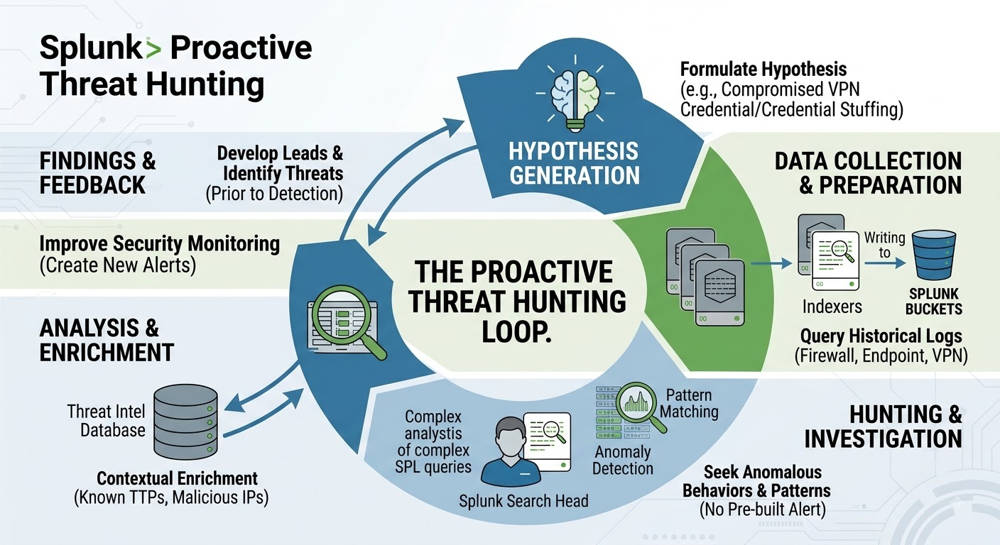
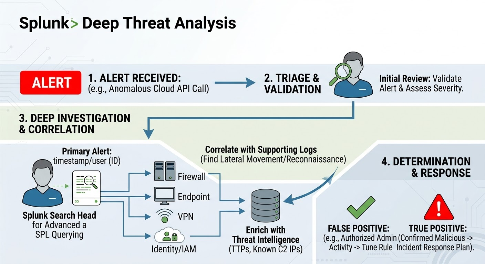
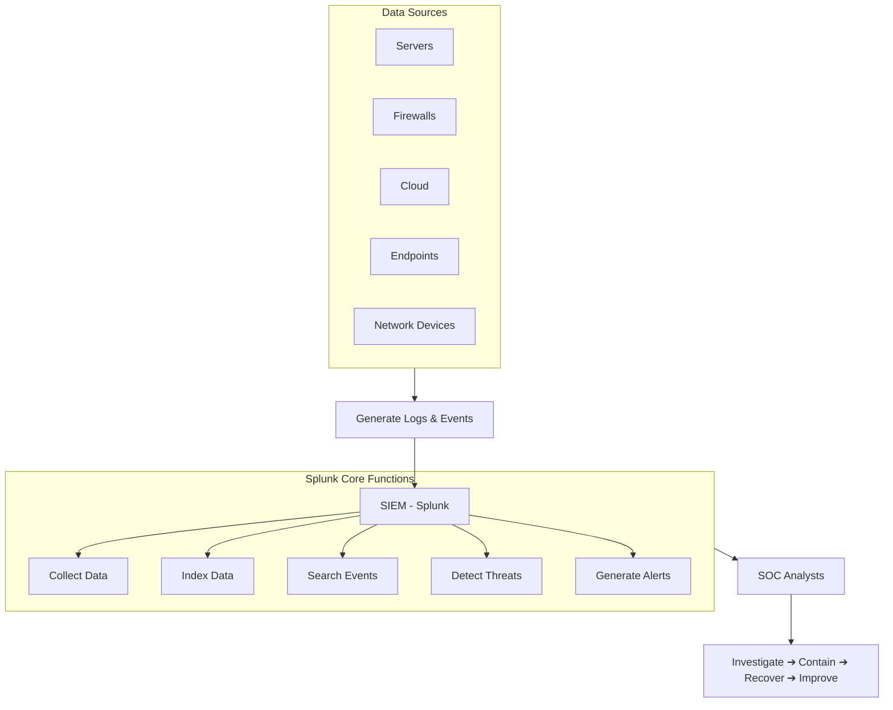
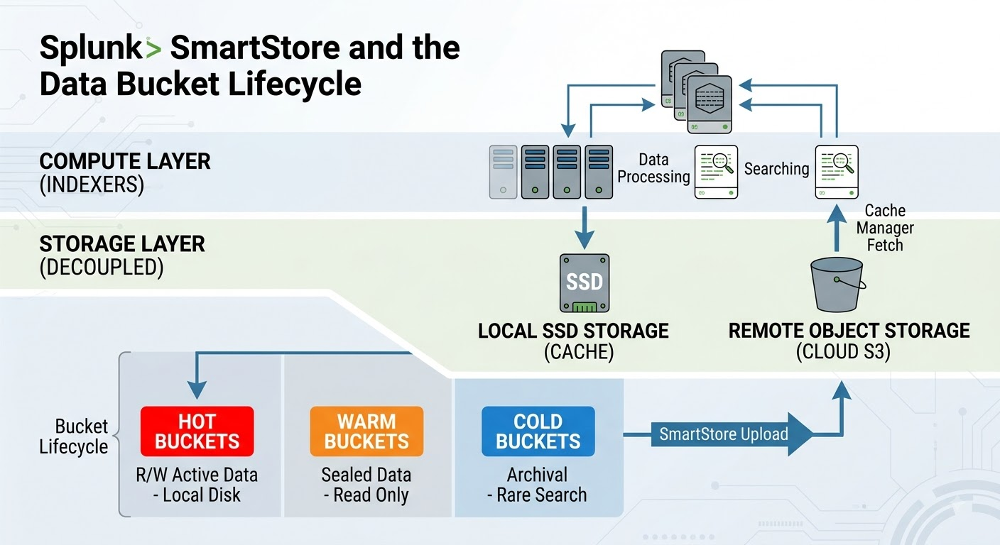

# Splunk and SOC Upskilling

## Table of Contents
1. [Security Operations Centre (SOC) Fundamentals](#1-security-operations-centre-soc-fundamentals)
2. [SIEM (Security Information and Event Management)](#2-siem-security-information-and-event-management)
3. [Introduction to Splunk](#3-introduction-to-splunk)
4. [Splunk Architecture & Deployment](#4-splunk-architecture--deployment)
5. [Splunk Data & Ingestion](#5-splunk-data--ingestion)
6. [Splunk Processing Language (SPL)](#6-splunk-processing-language-spl)
7. [Advanced Splunk Concepts & Use Cases](#7-advanced-splunk-concepts--use-cases)
8. [Best Practices, Certifications & Future Trends (Optional Extensions)](#8-best-practices-certifications--future-trends-optional-extensions)
9. [Glossary](#9-glossary)

This repository documents my research and practical setup for Security Operations Centre (SOC) fundamentals, SIEM technologies, and Splunk architecture.

## 1. Security Operations Centre (SOC) Fundamentals

**What is a SOC?**
A Security Operations Centre (SOC) is a centralised function within a business that employs people, processes, and technology to continuously monitor and improve the organisation's security posture. Its primary goal is to prevent, detect, analyse, and respond to cybersecurity incidents.

**Key Functions:**
* **Monitoring:** 24/7 observation of the IT environment to ensure complete visibility.
* **Detection:** Spotting suspicious activity or anomalies within the network traffic and logs.
* **Triage:** Assessing and prioritising alerts to separate genuine threats from false positives.
* **Incident Response:** Taking immediate action to contain and eradicate confirmed threats.
* **Threat Intelligence:** Gathering data on current global threats and adapting defences accordingly.

**Common Technologies:**
* **SIEM (Security Information and Event Management):** The core tool for ingesting logs and alerting (e.g., Splunk, Microsoft Sentinel).
* **EDR/XDR (Endpoint/Extended Detection and Response):** Monitoring individual devices like laptops and servers for malicious activity.
* **SOAR (Security Orchestration, Automation, and Response):** Automating repetitive responses to common alerts.
* **Firewalls & IDS/IPS:** Network barriers and Intrusion Detection/Prevention Systems.

**Processes (The Incident Response Lifecycle):**
1. **Preparation:** Setting up tools, configuring SIEM alerting rules, establishing playbooks, and training staff before an attack ever happens.
2. **Identification:** Confirming a genuine attack is underway, either reactively through an alert or proactively through threat hunting.
3. **Containment:** Stopping the bleeding to prevent lateral movement. This includes isolating infected laptops from the network, disabling compromised user accounts, or blocking malicious IP addresses at the firewall.
4. **Eradication:** The phase focused on removing the threat entirely from the environment. Examples include:
    * Deleting the malicious files or malware executables.
    * Identifying and removing hidden backdoor accounts created by the attacker.
    * Re-imaging a severely compromised machine (wiping the hard drive completely).
    * Applying security patches to fix the software vulnerability that allowed the attacker in.
    * Forcing a global password reset for all compromised users.
5. **Recovery:** Bringing systems safely back online and monitoring them closely to ensure the attacker does not immediately return.
6. **Lessons Learned:** The crucial post-incident review. Documenting the breach, updating SIEM detection rules, and modifying playbooks so the exact same attack cannot succeed again.

**Challenges:**
* **Alert Fatigue:** Analysts becoming overwhelmed by the sheer volume of alerts and false positives.
* **Evolving Threats:** Cybercriminals constantly adapting their tactics, techniques, and procedures (TTPs).
* **The Skills Gap:** Finding and retaining highly trained security personnel.

**SOC Best Practices:**
* **Automation:** Using tools like SOAR to handle low-level alerts so analysts can focus on complex threats.
* **Continuous Tuning:** Regularly updating SIEM rules to reduce noise and false positives.
* **Threat Intelligence Integration:** Staying ahead by feeding real-time global threat data into local systems.

**Roles within a SOC:**

| Role | Responsibilities |
| :--- | :--- |
| **Tier 1 Analyst** | Triage. Reviews initial alerts, determines if they are true or false positives, and handles basic incidents. |
| **Tier 2 Analyst** | Incident Responder. Takes escalated tickets, performs deep-dive investigations, and contains the threat. |
| **Tier 3 Analyst** | Threat Hunter. Proactively searches the network for hidden threats that bypassed automated detection. |
| **SOC Manager** | Oversees operations, manages the team, handles budgeting, and reports to the CISO. |

**Threat Hunting:**
Unlike detection, which is reactive (waiting for a SIEM alert to fire), threat hunting is **proactive**. Analysts assume the network has already been breached and actively search through data to find sophisticated threats that have bypassed automated security controls.

### Proactive SOC Threat Hunting

This image visualizes the continuous, iterative loop of hypothesis-driven threat hunting using Splunk.

*Key stages visualized: Hypothesis Generation, Proactive Search/Querying, Pattern & Anomaly Detection, and Feedback Loop (Alert Rule Creation).*

**Common Event Types to Look Out For:**
* **Failed Login Attempts:** Especially "brute force" patterns (e.g., hundreds of failed logins in a minute).
* **Unusual Outbound Traffic:** Large amounts of data leaving the network, which could indicate data exfiltration.
* **Privilege Escalation:** A standard user suddenly attempting to gain administrative rights.
* **Suspicious File Executions:** Unknown or malicious software (malware) running on an endpoint.

### Deep SOC Threat Analysis

This image details the deep investigative flow that occurs after a reactive alert trigger.

*Key stages visualized: Alert Trigger, Triage & Validation, Deep Investigation & Correlation (using multiple log sources and Threat Intel enrichment), and Determination (True Positive vs. False Positive).*

## 2. SIEM (Security Information and Event Management)

**What is SIEM?**
SIEM is a software solution that ingests, aggregates and analyses activity from many different resources across an entire IT infrastructure. It collects machine-generated logs (the "Information"), translates/parses them into a readable format, and uses rules to identify suspicious patterns, generating alerts (the "Event Management") for security analysts to investigate.

**An Analogy for SIEM:**
Imagine a large casino with hundreds of security cameras, card readers, and cash registers. 
* Individually, these devices generate too much raw data for one person to watch simultaneously. 
* A **SIEM** acts like the central security control room. It takes the feed from every single camera, door, and register across the building and puts them onto one massive wall of screens. 
* Crucially, it doesn't just show the data; it uses logic. If it notices a door being forced open while the camera feed in that hallway suddenly goes blank, it sounds an alarm for the human guards (the SOC analysts) to investigate.

### SOC & SIEM Data Flow

**Examples of SIEM Software in 2026:**
* **Splunk Enterprise Security:** Highly customisable and dominant in large enterprises.
* **Microsoft Sentinel:** A cloud-native SIEM tightly integrated with the Azure ecosystem.
* **IBM QRadar:** Known for its strong out-of-the-box behavioural analytics.
* **Google SecOps (formerly Chronicle):** Designed to handle massive volumes of data at incredibly high speeds using Google's infrastructure.
* **Datadog Cloud SIEM:** Popular for its strong integration with developer and operational monitoring tools.

## 3. Introduction to Splunk

**What is Splunk?**
Splunk is a powerful software platform used to search, analyse, and visualise machine-generated data in real-time. While it started as a general data analysis tool, its ability to handle massive volumes of logs quickly made it the industry standard SIEM platform for enterprise cybersecurity.

**What can Splunk be used for and why use it?**
* **Cybersecurity (SIEM):** Detecting threats, investigating breaches, and monitoring network health.
* **IT Operations:** Troubleshooting application crashes, monitoring server performance, and predicting hardware failures.
* **Business Analytics:** Tracking user behaviour on websites, monitoring sales transactions, and visualising customer trends.
* **Why use it?** It is incredibly fast at searching unindexed, unstructured data (like raw text logs). It scales to handle petabytes of data, and its dashboarding capabilities make complex data easy to understand for non-technical stakeholders.

**What is a Splunk/SOC Analyst?**
A SOC Analyst using Splunk is a security professional who uses the platform as their primary tool to monitor an organisation's network. They write custom SPL (Splunk Processing Language) queries to investigate alerts, create dashboards to monitor threat trends, and tune the system to detect new attack methods while reducing false positives.

**Versions of Splunk:**
| Version | Description |
| :--- | :--- |
| **Splunk Enterprise** | The core, on-premises software. Highly customisable and installed on a company's own local servers. |
| **Splunk Cloud Platform** | The SaaS (Software as a Service) version. Splunk hosts and manages the infrastructure, reducing overhead for the business. |
| **Splunk Free** | A limited version for personal use or very small environments, restricted to ingesting 500MB of data per day with no alerting capabilities. |
| **Splunk Enterprise Security (ES)** | A premium application built on top of Splunk Enterprise, specifically designed with pre-built SOC dashboards, incident review tools, and advanced threat intelligence integrations. |

**Which Version Should a Business Choose?**
* **Splunk Cloud (SaaS):** Best for **start-ups, mid-market businesses, and cloud-first tech companies** (e.g., e-commerce, digital platforms). These companies want zero hardware management overhead and need to scale their data capacity rapidly.
* **Splunk Enterprise (On-Premises):** Essential for **highly regulated industries** (e.g., banking like Deutsche Bank, healthcare, government, and defence). These sectors often face strict data sovereignty laws requiring total physical control of data, or they operate on "air-gapped" networks with no internet connection.

## 4. Splunk Architecture & Deployment

**Components of Splunk Architecture:**
At its core, Splunk operates as a three-stage data pipeline. These components work together to collect, store, and analyse data.

* **Universal Forwarders (UF):** The absolute standard for data collection. These are incredibly lightweight agents installed directly on endpoints (laptops, servers). Their only job is to silently collect raw machine logs and stream them across the network to Splunk. They use minimal CPU and memory, and crucially, they do *not* parse or alter the data themselves.
* **Heavy Forwarders (HF):** A much more robust, heavier forwarding agent. Unlike a UF, a Heavy Forwarder actually parses and filters the data *before* sending it over the network. SOCs use Heavy Forwarders to drop useless log events to save on expensive storage costs, or to mask sensitive data (like removing passwords from a log text) before it reaches the Indexer.
* **Indexers (The Storage & Processing Engine):** The heavy lifters of the architecture. Indexers receive the raw data, parse it (breaking it into events and extracting fields), and store it on disk in structured files called "buckets." They build a searchable index that allows analysts to query massive volumes of data instantly.
* **Search Head (The UI):** This is the web interface (the centralised console) you log into as an analyst. It does not store the data itself. When you type an SPL query, the Search Head distributes that search to all the Indexers, gathers their individual results, merges them together, and displays them to you. It also manages all Knowledge Objects, dashboards, and alerts.
* **Monitoring Console (MC):** A critical, built-in Splunk application used by administrators. It acts as the "health check" dashboard for the entire Splunk architecture. It provides a visual interface to monitor how full the indexer storage capacity is, check if the Search Head is maxing out its CPU usage, and ensure all Universal Forwarders are actively phoning home.

**Options for Deploying Splunk:**
As organisations grow and ingest more data, they cannot run Splunk on just one server. They scale using different architectural deployments:

* **Standalone Deployment:** The Search Head, Indexer, and Forwarder all run on a single machine. This is exactly how your local Docker container is set up for learning, but it is never used in a real enterprise SOC because it cannot handle large data volumes.
* **Distributed Search:** The Search Head is placed on its own dedicated server, and it queries multiple different Indexer servers simultaneously. This speeds up searching massively because the workload is shared.
* **Search Head Clustering (SHC):** A group of multiple Search Heads that share the exact same configurations, dashboards, and user sessions. If one Search Head server crashes, the others take over seamlessly (High Availability), and it balances the load when hundreds of analysts are searching at the same time.
* **Indexer Clustering:** Replicating the stored log data across multiple Indexers so that if a hard drive fails or a server goes offline, no historical security logs are lost.

**Splunk SmartStore (Decoupling Compute & Storage):**
In modern deployments (especially Splunk Cloud), Splunk uses an architecture called **SmartStore** to separate processing power from hard drive space. 
* **Hot Data (Active):** Kept on incredibly fast, expensive local SSDs on the Indexer for real-time writing and searching.
* **Warm/Cold Data (Historical):** Automatically moved to massive, cheap cloud object storage (like **AWS S3 buckets**). 

*Why this matters:* It allows organisations to "decouple compute from storage." A business can endlessly expand their historical log retention in low-cost cloud storage without ever needing to buy additional, expensive physical Indexer servers just for the hard drive space.

## 5. Splunk Data & Ingestion

**What is Event Data?**
An event is a single, timestamped record of machine-generated data that occurs on an IT system. Splunk breaks every single event down into two distinct categories:
1. **The Context (Metadata):** The tags assigned by Splunk to categorise and organise the data as it enters the system. This includes:
    * **Timestamp:** The exact date and time the event occurred.
    * **Host:** The name or IP of the physical machine generating the log.
    * **Source:** The exact file path or port the data came from.
    * **Sourcetype:** The instruction manual telling Splunk how to format the data.
2. **The Content (The Payload):** 
    * **Raw Text:** The actual, original text string generated by the machine.
    * **Extracted Fields:** Specific categories of identifiers (like `user=` or `src_ip=`) that Splunk automatically pulls out of the raw text to make searching easier.

**Basic Terms in Splunk (The Metadata Fields):**
When data enters the indexer, Splunk automatically tags every single event with four crucial default fields so you can filter and find it later:
* **Host:** The name or IP address of the physical machine, server, or device that generated the data (e.g., `UK-LON-LPT-01` or `192.168.1.5`).
* **Source:** The exact file path, script, or network port the data was read from (e.g., `/var/log/auth.log` or `UDP:514`).
* **Sourcetype:** The most important field in Splunk. It identifies the format of the data (e.g., `linux_secure`, `cisco:asa`, `json`). It acts as the instruction manual telling Splunk exactly how to break the text apart, find the timestamp, and extract fields.
* **Index:** The logical storage container where the data is kept. A SOC typically uses different indexes for different data types to restrict access and speed up searches (e.g., `index=network` vs `index=endpoints`).

**The Index:**
The Index is the highly structured, logical storage container where this event data is permanently stored on the Indexer's hard drive, usually separated into "buckets" (Hot, Warm, and Cold based on age).

**What type of data/files does Splunk usually ingest?**
Splunk can ingest and parse virtually any format of IT data, categorised broadly as:
1. **OS & Log Files:** Raw text logs generated by operating systems (e.g., Windows Event Logs, Linux Syslog `/var/log/auth.log`).
2. **Structured Files:** Pre-formatted data tables where fields are already defined (e.g., CSV, JSON, and XML files).
3. **Network Data:** Traffic routing and security logs (e.g., Firewall allow/block logs, proxy server web traffic, and IDS/IPS alerts).
4. **Cloud & SaaS Data:** Activity logs pulled via APIs from remote environments (e.g., AWS CloudTrail, Microsoft 365 logins, Salesforce user activity).
5. **Sensor Data:** Outputs from physical security and IoT devices (e.g., office badge swipe readers, temperature sensors in server rooms).
6. **Script Outputs:** Data generated by custom Python, PowerShell, or Bash scripts.

**How can Splunk onboard/ingest data?**
Ingestion methods depend entirely on the environment and the data source:
* **Training & Development Methods:**
  * **Manual Upload:** Uploading a static, historical file (like a CSV) directly via the web UI. Great for testing, but never used for live environments.
  * **Monitoring Files/Dirs:** Pointing Splunk to continuously watch a specific local folder on its own hard drive for new log entries.
* **Real-World / Enterprise Methods:**
  * **Universal Forwarders (UFs):** The standard enterprise method for securely streaming real-time data from thousands of remote endpoints.
* **Workarounds & Alternative Inputs:**
  * **Network Inputs:** Configuring Splunk to listen directly on a network port (e.g., UDP 514). Used heavily for legacy network devices (like old switches or firewalls) that cannot have a Universal Forwarder installed on them.
  * **HTTP Event Collector (HEC):** A highly efficient, token-based method for securely sending data directly to Splunk over HTTP/HTTPS. Extremely popular for collecting logs from modern web applications and serverless cloud functions.

## 6. Splunk Processing Language (SPL)

**What is SPL?**
Splunk Processing Language (SPL) is the proprietary language used to search, filter, modify, and visualise data within Splunk. 

It is built on a "pipeline" concept, similar to Unix/Linux command lines. You use the pipe character (`|`) to connect commands. The data flows from left to right: the results of the first search are "piped" into the next command to be filtered, then piped into the next command to be transformed, and so on.

**Basic Examples of SPL:**

**1. Basic Searches (Filtering the raw data)**
Before using any pipes, you start by querying the raw events using keywords and metadata fields.
* **Find all failed logins on a specific server:**
  `index=security sourcetype=windows_logs host=Server-01 action=failure`
* **Find events containing a specific IP address or a keyword:**
  `index=firewall "192.168.1.50" OR "malware"`

**2. Basic Transformations (Structuring and calculating)**
Transforming commands take raw event logs and turn them into statistical data tables (like calculating averages, counts, or finding the most common values).
* **Count the number of failed logins per user:**
  `index=security action=failure | stats count by user`
* **Find the top 5 IP addresses generating the most blocked traffic:**
  `index=firewall action=blocked | top limit=5 src_ip`
* **Format the raw data into a clean, readable table with specific columns:**
  `index=endpoints | table _time, host, user, process_name`

**3. Basic Visualisations (Creating charts)**
These commands group data specifically over time or by category so that Splunk can automatically generate graphs and charts on the dashboard.
* **Create a line chart showing network traffic spikes over time:**
  `index=network | timechart span=1h count`
* **Create a pie chart showing the breakdown of different operating systems on the network:**
  `index=endpoints | chart count by os_version`

## 7. Advanced Splunk Concepts & Use Cases

**Knowledge Objects (KOs) in Splunk:**
A Knowledge Object is a user-defined entity that enriches, normalises, or visually represents the raw data to make it easier for analysts to interpret. Key KOs include:
* **Fields:** Categories of identifiers extracted from the raw text (e.g., telling Splunk that a string of numbers in a log should be categorised under the field `src_ip`).
* **Lookups:** Tables (often CSV files) used to map log data to external, real-world information. *Example: A lookup table can translate an IP address in your logs into a physical country location, or map a username to a specific corporate department.*
* **Macros:** Reusable chunks of SPL code. If you have a massive, complex search string you use every day, you can save it as a Macro and just type `` `my_macro` `` instead of rewriting it.
* **Tags:** Aliases given to specific field/value pairs. *Example: Tagging all IP addresses belonging to the database servers as "PCI_Scope" so they are easily searchable.*
* **Event Types:** A way to categorise events based on a specific search string. *Example: Creating an Event Type called "Successful_Login" that automatically tags any event containing `action=success`.*
* **Alerts:** A saved search that constantly runs in the background and triggers an automated action (like sending an email to the SOC or executing a SOAR playbook) when specific conditions are met.
* **Dashboards:** The centralised face of data visualisations. They combine multiple charts, graphs, and tables to tell a comprehensive story or answer critical business questions at a glance (e.g., a "SOC Overview" dashboard displaying global threat maps and current active alerts). Dashboards are frequently the final product in SOC analyst projects.

**Splunk Apps vs Splunk Add-ons:**
* **Add-ons (The Plumbers):** These run entirely in the background without a visual user interface. Their main job is data collection and formatting. They provide the instructions (sourcetypes and field extractions) to tell Splunk exactly how to ingest and parse data from a specific vendor, like a Cisco firewall or a Windows server.
* **Apps (The Visualisers):** Comprehensive packages that *do* have a navigable, graphical UI. They rely heavily on the raw data brought in by Add-ons to populate pre-built dashboards, reports, and specialised analyst workspaces. *Example: The Splunk Enterprise Security (ES) App.*

**Case Studies of Splunk in Action:**

* **Security/SOC (Insider Threat Detection):** A financial institution uses Splunk to monitor badge-swipe data at physical office doors and correlates it with VPN login logs. Splunk detects an anomaly: a user badged into the London office, but 10 minutes later, their account successfully logged into the VPN from an IP address in Asia. Splunk triggers a high-severity alert for a compromised credential.
* **Security/SOC (Ransomware Mitigation):** Splunk is configured to monitor file extension changes across corporate servers. When it detects a sudden, massive spike in files being renamed to `.encrypted` on a specific host, it automatically alerts the SOC and triggers a script to disconnect that host from the network before the ransomware can spread.
* **Data/Business Analysis (E-commerce):** An online retailer ingests web server logs into Splunk to track the customer journey. They build a dashboard showing exactly where users abandon their shopping carts, allowing the web development team to fix broken links and increase sales revenue.
* **IT Operations (Observability):** A telecommunications company uses Splunk to monitor the CPU, RAM, and error logs of their customer service application servers. Splunk predicts a server crash before it happens based on resource spikes, allowing engineers to restart the service during off-peak hours without customers ever noticing an outage.

## 8. Best Practices, Certifications & Future Trends (Optional Extensions)

**Best Practices for Securing Data on Splunk:**
Since a SIEM holds the keys to the kingdom (all an organisation's security logs), the platform itself must be heavily secured.
* **Role-Based Access Control (RBAC):** Implementing strict permissions so that Tier 1 Analysts, for example, cannot alter core system configurations or delete indexes.
* **Data Masking:** Hiding highly sensitive information (like credit card numbers or passwords accidentally typed into usernames) before the data is written to disk.
* **Audit Logging:** Monitoring the monitors. Splunk tracks every search query run by its own users to ensure analysts aren't abusing the system to view unauthorised data.
* **Data Retention Policies:** Ensuring logs are kept only as long as legally or operationally necessary, both to save storage costs and comply with data privacy laws (like GDPR).

**Encrypting Data in Splunk:**
* **In Transit:** Using SSL/TLS certificates to encrypt the data as it travels across the network from Universal Forwarders to the Indexers, preventing "man-in-the-middle" attacks.
* **At Rest:** Using OS-level encryption (like Linux LUKS or Windows BitLocker) on the hard drives where the Indexer buckets are stored, or using Splunk's native data-at-rest encryption to protect the raw data files.

**Splunk Certification Path (SOC Relevance):**

| Certification | Relevance to SOC |
| :--- | :--- |
| **Splunk Core Certified User** | **High.** The starting point. Proves you can navigate the UI, run basic searches, and use basic fields. |
| **Splunk Core Certified Power User** | **Very High.** The sweet spot for analysts. Proves you understand advanced SPL, data parsing, and creating knowledge objects (dashboards/reports). |
| **Splunk Certified Cybersecurity Defense Analyst** | **Crucial.** Directly tests your ability to use Splunk Enterprise Security (ES) to detect, investigate, and respond to cyber threats. |
| **Splunk Enterprise Certified Admin** | **Low/Medium.** Focuses on managing the server health, deploying forwarders, and configuring the back-end architecture. Better suited for Splunk Engineers than SOC Analysts. |

**AI with Splunk:**
Artificial Intelligence is rapidly changing how SOCs operate. Splunk utilises AI in two main ways:
* **Splunk AI Assistant:** A generative AI tool that allows analysts to type what they want in natural English (e.g., "Show me all failed logins from outside the UK") and the AI writes the complex SPL query for them. 
* **Machine Learning Toolkit (MLTK):** Used for advanced behavioural detection. Instead of writing rigid rules, the MLTK learns what a "normal" day looks like on the network and automatically flags abnormal spikes in activity.

**Recommended Datasets for Splunk:**
* **Boss of the SOC (BOTS):** Splunk's official, open-source dataset. It is a massive collection of real-world logs captured during a simulated cyberattack. It is the gold standard for analysts wanting to practice threat hunting on a local machine.
* **Splunk Tutorial Data:** A smaller, simpler dataset provided by Splunk specifically for learning basic SPL commands without the complexity of a full cyberattack.

**Guides / Walkthroughs / Demos for Splunk:**
* [Splunk Education (Free Fundamentals Courses)](https://www.splunk.com/en_us/training.html)
* [Splunk Docs (The Official Manual)](https://docs.splunk.com/)
* [YouTube: The Most Important Field in Splunk (Sourcetypes)](https://www.youtube.com/watch?v=fAt-HqPir0Y)

## 9. Glossary

| Term | Definition |
| :--- | :--- |
| **Air-Gapped** | A security measure where a computer or network is physically and logically isolated from unsecured networks, including the public internet. |
| **Alert Fatigue** | The desensitisation of SOC analysts caused by being continuously overwhelmed by a massive volume of alerts, leading to delayed responses or missed genuine threats. |
| **CVE** | Common Vulnerabilities and Exposures. A publicly disclosed list of cybersecurity vulnerabilities that is standardised and uniquely numbered (e.g., CVE-2026-1234). |
| **Data Exfiltration** | The unauthorised transfer, theft, or copying of data from a computer or server. This is often the primary objective of a cyberattack. |
| **EDR / XDR** | Endpoint / Extended Detection and Response. Tools installed directly on devices (laptops, servers) to monitor processes and block malicious activity at the host level. |
| **False Positive** | An alert that incorrectly flags benign, authorised, or normal network activity as malicious. |
| **[Host](#5-splunk-data--ingestion)** | The name or IP address of the physical machine, server, or device that generated the data. |
| **[Index](#5-splunk-data--ingestion)** | The logical storage container where the data is kept. A SOC typically uses different indexes for different data types to restrict access and speed up searches. |
| **[Indexer](#4-splunk-architecture--deployment)** | The storage and processing engine of Splunk. Indexers receive the raw data from the forwarders, parse it, and store it on disk in structured files called "buckets". |
| **IoA** | Indicator of Attack. Proactive signs that an attack is currently underway. IoAs focus on the intent and behaviour of the attacker rather than static evidence left behind. |
| **IoC** | Indicator of Compromise. A reactive piece of forensic data (like a malicious IP address or file hash) that suggests a network has already been breached. |
| **Lateral Movement** | Techniques that attackers use to move progressively from device to device through a network after gaining initial access, usually searching for higher privileges. |
| **MITRE ATT&CK** | A globally accessible knowledge base of adversary tactics and techniques based on real-world observations. SOCs use this framework to map and understand attacker behaviours. |
| **Playbook / Runbook** | A documented, step-by-step set of instructions that SOC analysts follow to standardise the response to specific types of security incidents. |
| **RBAC** | Role-Based Access Control. A method of restricting network access and system privileges based strictly on the user's specific job function or tier within the enterprise. |
| **[Search Head](#4-splunk-architecture--deployment)** | The web interface logged into by an analyst. It sends query requests down to the Indexers, merges the results together, and displays them. |
| **SIEM** | Security Information and Event Management. A central software solution that ingests, aggregates, and analyses log activity from across an entire IT infrastructure. |
| **SOAR** | Security Orchestration, Automation, and Response. Software used to automate repetitive incident response tasks and triage low-level alerts without human intervention. |
| **SOC** | Security Operations Centre. A centralised function within a business that employs people, processes, and technology to continuously monitor and improve the organisation's security posture. |
| **[Source](#5-splunk-data--ingestion)** | The exact file path, script, or network port the data was read from. |
| **[Sourcetype](#5-splunk-data--ingestion)** | Identifies the format of the data (e.g., `linux_secure`, `json`). It tells Splunk exactly how to break the text apart, find the timestamp, and extract fields. |
| **SPL** | Splunk Processing Language. The proprietary pipeline-based language used to search, filter, modify, and visualise data within Splunk. |
| **Threat Intelligence (CTI)** | Cyber Threat Intelligence. Data collected and analysed regarding current global threat actors, their motives, and their attack infrastructures. |
| **[Universal Forwarder](#4-splunk-architecture--deployment)** | Lightweight agents installed directly on endpoints. Their only job is to silently collect raw machine logs and forward them across the network to Splunk. |
| **Zero-Day** | A software vulnerability that is actively being exploited but is entirely unknown to the software vendor, meaning developers have had "zero days" to release a patch. |
| **Eradication** | The active incident response phase focused on removing a threat entirely from the IT environment. Examples include deleting malware, removing attacker backdoor accounts, patching exploited vulnerabilities, and forcing password resets. |
| **TTPs** | Tactics, Techniques, and Procedures. The specific, evolving behaviours, methodologies, and operational patterns used by cybercriminals to execute attacks. Analysing TTPs helps SOCs build proactive defences rather than just reacting to isolated indicators of compromise. |