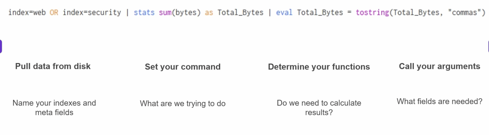
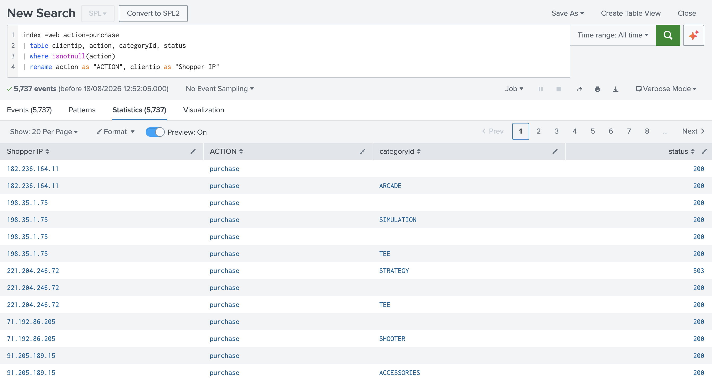
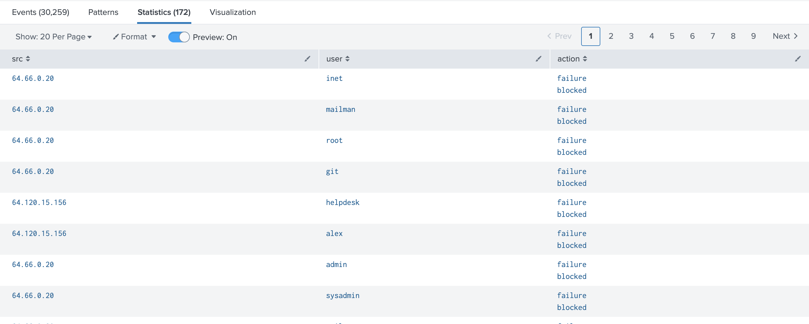
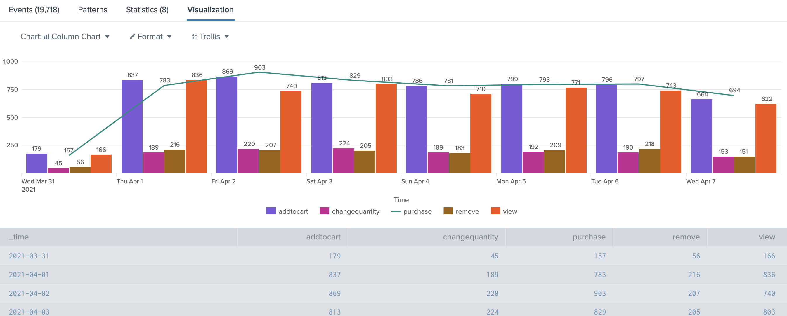

# Splunk: Core Architecture & SPL Fundamentals

## 1. The Splunk Ecosystem & Architecture
Splunk serves as the central nervous system for enterprise data analytics, acting as a data parser, organiser, and acceptor of all data forms. 

### Function vs. Action
*   **Splunk Function (The Platform):** The overarching capability to ingest data and provide metrics for all things. It delivers vital story insights—spanning security intelligence, business operations, and asset identities—while generating interactive visual displays like graphs, charts, and heat maps.
*   **Splunk Action (The Analyst):** The day-to-day operations performed by analysts using Search Processing Language (SPL). This includes conducting network traffic analysis, reviewing alerts, building custom signatures, and checking traffic patterns.

### Environment Setup & Limitations
*   **The Container:** This training environment is deployed via a Docker container acting as the primary software box, equipped with the Splunk Add-on for Cisco WSA and the Splunk Add-on for Unix and Linux.
*   **Index Routing:** Incoming data is logically routed to maintain organisation: `access.logs` are sent to the `web` index, `secure.logs` go to the `security` index, and `cisco_web.log` data is stored in the `cisco` index.
*   **macOS / Linux Blocker:** Because Splunk is running inside a Docker container (which utilises a Linux operating system under the hood), it cannot automatically monitor local macOS event logs or local performance metrics. To partially replicate local monitoring for demonstration purposes, the `/var/logs` directory can be mapped and enabled.

---

## 2. Search Processing Language (SPL) Basics
### Search Bar Mechanics
*   **Search History:** Use this feature to quickly repopulate previous search queries without retyping them.
*   **Timeline Filtering:** Highlighting a specific section of the timeline and double-clicking will automatically restrict your search to that exact time range, appending the timeframe to the query.
*   **Boolean Operators:** Splunk natively supports `OR`, `AND`, and `NOT`. *Crucial Note:* If an operator is not explicitly specified between two search terms, Splunk assumes `AND` by default.
*   **The Pipe Character (`|`):** Dictates data flow from left to right. The raw results of the search on the left are passed into the command on the right to be filtered, formatted, or calculated.
*   **Wildcards (`*`):** Can be used to yield a generic response, but they are highly resource-intensive and can severely tax the search head.
*   **Case Sensitivity:** Field names (e.g., `src_ip`) are *not* case-sensitive, but field values (e.g., `Windows`) *are* strictly case-sensitive.

### Splunk Syntax & Colour-Coding
Splunk visually colour-codes SPL to help you structure queries accurately at a glance:
*   **Orange (Command Modifiers):** `OR`, `NOT`, `AND`, `as`, `by`, `like`.
*   **Blue (Commands):** `stats`, `table`, `rename`, `dedup`, `sort`, `timechart`.
*   **Green (Arguments):** `limit`, `span`.
*   **Purple (Functions):** `tostring`, `sum`, `values`, `min`, `max`, `average`, `case`, `count`, `like`.

> *Pro-Tip: Press `Cmd + \` to auto-format a messy search string, and enable line numbers in the editor preferences to make team collaboration easier. Press `Cmd + Shift + E` to expand a search macro.*

---

## 3. Foundational Query Examples
Here are standard queries used to format, filter, and calculate data during live investigations.

### Filtering, Renaming, & Deduplication
*   **Filtering & Renaming Fields:**
    `index=web action=purchase | table clientip, action, categoryId, status | where isnotnull(action) | rename action as "ACTION", clientip as "Shopper IP"`
    
    

*   **Listing Unique Values:** 
    `index=web | dedup categoryId | stats list(categoryId)`
*   **Counting Distinct Values:** 
    `index=web | stats dc(categoryId)` *(Yields 2532 results)*
*   **Extracting Specific Values (No Duplicates):** 
    `index=web | stats values(referer_domain)` *(Yields bing, buttercupgames, google, yahoo)*

### Advanced Search Operators (`like`)
*   **Isolating IP Subnets:**
    `index=security | table src, user, action | where like(src, "64.%") | search user=inet`
    
    

---

## 4. Transforming Data & Advanced Stats
A transforming command takes raw, individual event logs and "transforms" them into a structured data table of aggregated statistics. You must use a transforming command before you can build any visualisations.

### Grouping and Correlating (`stats`)
*   **Multi-Field Counting:** 
    `index=web | stats count by referer_domain, action`
*   **Summarising Counts:** 
    `index=web | stats count by referer_domain, action | stats sum(count) by referer_domain`
*   **Handling Null Values:** 
    `index=security | stats values(user) as "ID", count(user) as "attempts" by src | fillnull value="no data available"`

### Visualisation Prep Queries
*   **Timechart Preparation:** 
    `index=web | where isnotnull(action) | timechart count by action`
    
    

*   **Charting with Lookups:** 
    `index=web action=purchase | lookup productinfo.csv productid OUTPUT desc | where isnotnull(productid) | chart count over host by desc useother=f limit=0`

### `transaction` vs. `stats`
The `transaction` command is an incredibly powerful tool used to group multiple, separate events together into one single, massive event based on a common thread (like a session ID). 

| Feature | `transaction` | `stats` |
| :--- | :--- | :--- |
| **Performance** | Slow and will tax your environment. | Faster, more efficient searching. |
| **Use Case** | Granular analysis (logs, user behaviour, conversations). | Looking at a larger pool of events for trend analysis. |
| **Scope** | Small scope on one item of interest. | Broad searching and grouping of events. |
| **Logic** | Correlations need to be found from start to end. | Mathematical functions needed (sums, averages). |

**Transaction Arguments:**
*   **`startswith` (The Trigger):** Defines the specific condition or keyword (like `"login"`) that officially opens a new transaction.
*   **`maxpause` (Inactivity Timer):** The maximum idle time allowed between individual events. If no logs are generated within this window, the transaction closes.
*   **`maxspan` (Hard Time Limit):** The maximum total duration allowed for the entire transaction, measured from the very first event to the very last.
*   *Example:* `index=security | transaction src startswith=sshd maxspan=3m maxpause=3s`